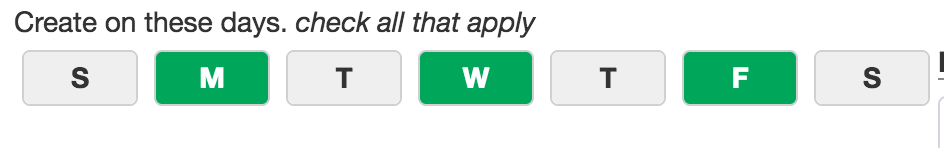

# yii2-checkboxButtonList

A really simple widget to display a list of checkboxes in button format

##Use

 `CheckboxButtonList::widget([
	 						'name'=>'days',
	 						'selection'=>'',
	 						'items'=>$model->weekdays
	 		]);
`

Example output:-

